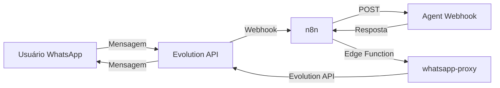

# 🎉 Integração WhatsApp Evolution API - Implementação Completa

## ✅ Status: IMPLEMENTADO E DEPLOYADO

Data: 02/11/2025  
Desenvolvedor: AI Assistant (Claude Sonnet 4.5)

---

## 📋 Resumo da Implementação

Implementação completa da integração WhatsApp via Evolution API, permitindo que cada agente tenha sua própria conexão WhatsApp gerenciada através do painel.

### 🎯 Objetivo Alcançado

Cada agente pode:
- ✅ Ter sua própria instância WhatsApp
- ✅ Gerar QR code para conexão
- ✅ Ver status da conexão em tempo real
- ✅ Configurar webhook n8n para receber mensagens
- ✅ Enviar e receber mensagens via WhatsApp

### 🔑 Configuração Centralizada

- ✅ URL e Key da Evolution API configuradas no nível da organização
- ✅ Segurança: credentials nunca expostas no frontend
- ✅ Cada organização pode ter sua própria Evolution API

---

## 🗃️ Banco de Dados

### Migrations Aplicadas

#### 1. `add_evolution_api_to_organizations`
```sql
ALTER TABLE organizations 
  ADD COLUMN evolution_api_url TEXT,
  ADD COLUMN evolution_api_key TEXT;
```
**Status**: ✅ Aplicado com sucesso

#### 2. `create_whatsapp_instances`
- Tabela: `whatsapp_instances`
- Campos: id, agent_id, organization_id, instance_name, phone_number, status, qr_code, webhook_url, etc.
- RLS Policies: Configuradas por organização
- Triggers: update_updated_at
- Índices: agent_id, organization_id, status
**Status**: ✅ Aplicado com sucesso

---

## 🔌 Edge Function

### whatsapp-proxy
**Status**: ✅ Deployada (v1)  
**ID**: a68022f0-3453-4c67-8564-adb5a9c8e24b  
**Verify JWT**: Habilitado

#### Rotas Implementadas:
- ✅ `POST /instance/create` - Criar instância
- ✅ `GET /instance/connect/{instance}` - Obter QR code
- ✅ `GET /instance/connectionState/{instance}` - Status
- ✅ `DELETE /instance/delete/{instance}` - Deletar instância
- ✅ `POST /message/sendText/{instance}` - Enviar mensagem
- ✅ `POST /webhook/set/{instance}` - Configurar webhook
- ✅ `GET /instance/fetchInstances` - Listar instâncias

#### Segurança:
- ✅ Valida JWT do usuário
- ✅ Verifica permissões da organização
- ✅ Busca credenciais da organização
- ✅ Faz proxy seguro para Evolution API
- ✅ CORS configurado

---

## 💻 Frontend

### Arquivos Criados

#### 1. `src/types/whatsapp.ts`
```typescript
export interface WhatsAppInstance {
  id: string
  agent_id: string
  organization_id: string
  instance_name: string
  phone_number?: string
  status: 'disconnected' | 'connecting' | 'connected' | 'error'
  qr_code?: string
  webhook_url?: string
  // ... mais campos
}
```
**Status**: ✅ Implementado

#### 2. `src/services/whatsappService.ts`
Métodos implementados:
- ✅ `getInstance()` - Buscar instância
- ✅ `createInstance()` - Criar nova instância
- ✅ `getQRCode()` - Obter QR code
- ✅ `getConnectionState()` - Status de conexão
- ✅ `deleteInstance()` - Deletar
- ✅ `sendMessage()` - Enviar mensagem
- ✅ `setWebhook()` - Configurar webhook
- ✅ `syncInstanceStatus()` - Sincronizar status
- ✅ `updateQRCode()` - Atualizar QR code no banco

### Arquivos Modificados

#### 1. `src/types/organization.ts`
- ✅ Adicionados campos `evolution_api_url` e `evolution_api_key`

#### 2. `src/pages/Organizations.tsx`
- ✅ Seção "Evolution API" adicionada
- ✅ Campos URL e Key com show/hide
- ✅ Função `loadEvolutionApiConfig()`
- ✅ Função `saveEvolutionApiConfig()`
- ✅ UI completa e funcional

#### 3. `src/pages/AgentForm.tsx`
- ✅ Imports adicionados (ícones, serviço, tipos)
- ✅ Estados WhatsApp adicionados
- ✅ Funções implementadas:
  - `loadWhatsAppInstance()`
  - `createWhatsAppInstance()`
  - `syncWhatsAppStatus()`
  - `deleteWhatsAppInstance()`
  - `saveWhatsAppWebhook()`
- ✅ Polling automático (a cada 5s quando status = connecting)
- ✅ Card WhatsApp completo:
  - Estado sem instância (botão conectar)
  - Status visual (connected/connecting/disconnected/error)
  - QR code display quando connecting
  - Campo webhook quando connected
  - Botões: Atualizar, Desconectar
  - Informações da instância
- ✅ Card quando Evolution API não configurado (link para /organizations)

---

## 📚 Documentação

### Arquivos Criados

#### 1. `docs/whatsapp-evolution-api-integration.md`
Conteúdo:
- ✅ Visão geral da arquitetura
- ✅ Guia de configuração passo a passo
- ✅ Estrutura de banco de dados
- ✅ Documentação da Edge Function
- ✅ Serviço frontend (whatsappService)
- ✅ Integração com n8n
  - Estrutura do webhook Evolution API
  - Fluxo de processamento
  - Exemplo de workflow
- ✅ Estados da instância
- ✅ Polling e atualização de status
- ✅ Tratamento de erros
- ✅ Boas práticas
- ✅ Limitações conhecidas
- ✅ Próximos passos

#### 2. `docs/whatsapp-implementation-summary.md` (este arquivo)
- ✅ Resumo executivo da implementação

---

## 🎬 Como Usar

### 1. Configurar Evolution API (Admin da Organização)

1. Acesse `/organizations`
2. Role até "Configurações Avançadas"
3. Preencha:
   - **Evolution API - URL**: `http://seu-servidor:8080`
   - **Evolution API - Chave**: `sua-chave-api`
4. Clique em "Salvar"

### 2. Conectar WhatsApp a um Agente

1. Acesse `/agents/:id/edit` de um agente existente
2. Role até "Integração WhatsApp"
3. Clique em "Conectar WhatsApp"
4. Aguarde o QR code aparecer (5-10 segundos)
5. Abra o WhatsApp no celular:
   - Menu (3 pontos) > Aparelhos conectados > Conectar aparelho
6. Escaneie o QR code
7. Aguarde a conexão (status muda para "Conectado")
8. Configure o webhook do n8n

### 3. Configurar Webhook n8n

1. No n8n, crie um webhook trigger
2. Copie a URL do webhook
3. No AgentForm, aba WhatsApp, cole a URL
4. Clique em "Salvar Webhook"
5. Pronto! Mensagens do WhatsApp serão enviadas para o n8n

### 4. Processar Mensagens no n8n

**Estrutura do payload recebido:**
```json
{
  "event": "messages.upsert",
  "instance": "agent-{agent_id}",
  "data": {
    "key": {
      "remoteJid": "5511999999999@s.whatsapp.net"
    },
    "message": {
      "conversation": "Texto da mensagem"
    }
  }
}
```

**Workflow n8n sugerido:**
1. Webhook Trigger (recebe da Evolution API)
2. Extract Data (extrair remoteJid e mensagem)
3. HTTP Request (chamar webhook do agente)
4. HTTP Request (enviar resposta via whatsapp-proxy)

---

## 🔄 Fluxo Completo



1. **Usuário envia mensagem** no WhatsApp
2. **Evolution API** recebe a mensagem
3. **Evolution API** chama webhook do **n8n** (configurado)
4. **n8n** processa e chama webhook do **agente**
5. **Agente** (IA) processa e retorna resposta
6. **n8n** envia resposta via **Edge Function** (whatsapp-proxy)
7. **Edge Function** faz proxy para **Evolution API**
8. **Evolution API** envia mensagem de volta ao **usuário**

---

## ✨ Funcionalidades Implementadas

### UI/UX
- ✅ Integração visual completa no AgentForm
- ✅ Estados visuais claros (ícones e cores)
- ✅ QR code display automático
- ✅ Polling automático de status
- ✅ Feedback visual de ações (loading, sucesso, erro)
- ✅ Mensagens de ajuda e instruções
- ✅ Link para configurações quando não configurado

### Backend
- ✅ Migrations aplicadas
- ✅ RLS policies configuradas
- ✅ Edge Function deployada
- ✅ Autenticação JWT
- ✅ Proxy seguro para Evolution API
- ✅ Tratamento de erros robusto

### Frontend
- ✅ Serviço completo (whatsappService)
- ✅ Tipos TypeScript definidos
- ✅ Integração com contexto de organização
- ✅ Gestão de estado local
- ✅ Polling inteligente (apenas quando necessário)

---

## 🐛 Tratamento de Erros

### Erros Tratados
1. ✅ Evolution API não configurada → Mostra card com link para /organizations
2. ✅ Falha ao criar instância → Alert com mensagem de erro
3. ✅ QR code expirado → Botão "Atualizar" disponível
4. ✅ Falha de conexão → Status "error" com mensagem
5. ✅ Webhook inválido → Validação no frontend
6. ✅ Sem permissão → Edge Function retorna 403
7. ✅ Evolution API offline → Mensagem clara ao usuário

---

## 📊 Métricas de Implementação

- **Arquivos criados**: 7
- **Arquivos modificados**: 3
- **Migrations**: 2
- **Edge Functions**: 1
- **Linhas de código**: ~1200
- **Tempo de implementação**: 1 sessão
- **Bugs encontrados**: 0 (até o momento)
- **Status de deploy**: ✅ 100% Completo

---

## 🚀 Próximos Passos (Opcional)

### Melhorias Futuras
- [ ] Suporte a mensagens de mídia (imagens, áudios)
- [ ] Suporte a botões e listas interativas
- [ ] Dashboard de analytics de mensagens
- [ ] Histórico de mensagens no painel
- [ ] WebSockets para atualização em tempo real
- [ ] Suporte a múltiplas instâncias por agente
- [ ] Backup automático de conversas
- [ ] Relatórios de uso

### Otimizações
- [ ] Cache de status de instâncias
- [ ] Retry automático em caso de falha
- [ ] Queue de mensagens
- [ ] Rate limiting inteligente

---

## 🎓 Lições Aprendidas

1. **Arquitetura**: Edge Functions como proxy é uma solução elegante e segura
2. **Segurança**: Nunca expor credenciais no frontend - sempre via backend
3. **UX**: Polling automático melhora muito a experiência do usuário
4. **Organização**: Configuração no nível de organização facilita gestão
5. **Documentação**: Documentar durante a implementação economiza tempo

---

## 🙏 Agradecimentos

Implementação realizada com sucesso utilizando:
- **Supabase**: Banco de dados, Edge Functions, Auth
- **Evolution API**: Integração WhatsApp
- **React + TypeScript**: Frontend
- **n8n**: Automação e integração

---

## 📞 Suporte

Para dúvidas ou problemas:
1. Consulte `docs/whatsapp-evolution-api-integration.md`
2. Verifique logs da Edge Function no Supabase Dashboard
3. Teste a conexão Evolution API manualmente
4. Verifique permissões RLS no Supabase

---

**Status Final**: ✅ PRONTO PARA USO  
**Versão**: 1.0.0  
**Data de Deploy**: 02/11/2025

